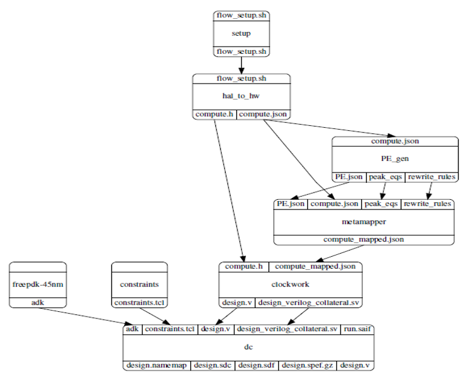

# Mflowgen for Compiler Flow
This project contains an mflowgen design for the AHA compiler flow. 



- **setup**: Specifies all the paths that will be accessed throughout the flow. The user edits the `setup/inputs/flow_setup.sh` file to specify the correct paths and set the `app_name`. The setup step copies this file into the build directory for the following steps to access.  

- **hal_to_hw**: Converts the application halide specification into a CoreIR representation. The CoreIR graph contains computation primitives (add, mul, sub etc.) as well as unified buffers (abstract memories) The step outputs are a `compute.json` file and a `compute.h` file. 

- **PE_gen**: Takes the CoreIR graph (`compute.json`) and does a frequent subgraph analysis to find potential PE architectures that might perform well for the given application. It outputs `PE.json` file along with `rewrite_rules` and `peak_eqs` to be further used by the mapper.

- **metamapper**: Maps CoreIR compute nodes to PEs by selecting correct PE instructions. This step's output is a `compute_mapped.json` file.

- **clockwork**: Maps the unified buffers (abstract memories) to the hardware memories. It's outputs are a `design.v` file and a `design_verilog_collateral.sv` file which provide an RTL description of the hardware with both the PEs and the memories.

- **dc**: Synthesizes an optimized gate level netlist from the RTL description and provides area, power and timing reports. Note that the PE blocks have to be synthesized first and then the same PE instance is used to synthesize the entire RTL.   

# Installation Requirements


# Notes
- The PE_gen step needs a parameter `dse_merge_param` to be set. This parameter specifies which of the subgraphs are to be merged to form the PE. Ideally, this parameter is specified something like `"0 1 2"` which would mean that these three subgraphs are to be merged. However, when performing parametric sweeps, mflowgen appends the paramter values to the step names to create the different steps and the ' ' character causes issues with the step names. Hence the `dse_merge_param` is set as `"0-1-2"` instead. Before passing to the DSEGraphAnalysis tool, this string is converted by the step to the required format. Currently, the `construct_graph.py` file spcifes a sweep range on this parameter on line 143. To run without sweeping for a single set parameter value, uncommment line 31 and comment out line 143.

- The metamapper step calls a script `map_dse_new.py`. This script is a slightly edited version of the `map_dse.py`. The only change that needs to be made is to set `DSE_PE_location = "DSE_outputs"`. The reason this is done is for metamapper to have it's separate input location rather than taking input's directly from 'DSEGraphAnalysis' (i.e PE_gen step) output location in order to maintain modularity. This is especially necessary for parametric sweeps.

- The clockwork step needs a list of environment variables to be set. The path where the clockwork step looks to find these is specified in `setup/inputs/flow_setup.sh`. The current design looks for a file `setup1.sh` located at `$my_root`    
```bash
export BUILD_DIR=`pwd`
export TRAVIS_BUILD_DIR=$BUILD_DIR
export BARVINOK_PATH=$TRAVIS_BUILD_DIR/clockwork/barvinok-0.41/isl
export ISL_PATH=$TRAVIS_BUILD_DIR/clockwork/barvinok-0.41/isl
export OPT_PATH=$TRAVIS_BUILD_DIR/clockwork/include
export OPT_LIB_PATH=$TRAVIS_BUILD_DIR/clockwork/lib
export LD_LIBRARY_PATH=$LD_LIBRARY_PATH:$TRAVIS_BUILD_DIR/clockwork/lib
export LD_LIBRARY_PATH=$LD_LIBRARY_PATH:$TRAVIS_BUILD_DIR/coreir/lib
export LD_LIBRARY_PATH=$LD_LIBRARY_PATH:$TRAVIS_BUILD_DIR/Halide-to-Hardware/coreir/lib
export LLVM_VERSION=6.0.0
export BUILD_SYSTEM=MAKE
export CXX_=g++-7
export CC_=gcc-7
export CXX=g++-7
export CC=gcc-7
export LLVM_CONFIG="/usr/bin/llvm-config-6.0"
export LLVM_DIR="/usr/lib/llvm-6.0/cmake"
export CLANG="/usr/bin/clang-6.0"
alias clang='clang-6.0'
alias clang++='clang++-6.0'
alias llvm-config='llvm-config-6.0'
export COREIR_PATH=$TRAVIS_BUILD_DIR/coreir
export COREIR_DIR=$TRAVIS_BUILD_DIR/coreir
export COREIR=1
```

- The DC step defined here is a slight modification of the DC step defined at mflowgen/steps/synoptic-dc-synthesis. The first key change is that in our flow, the `design.v` RTL verilog produced by clockwork needs another `design_verilog_collateral.sv` file which defines certain modules used in `design.v`. The DC step copies contents of `design_verilog_collateral.sv` to `design2.sv`. In the file `dc/scripts/read_design.tcl` the line
```bash
if { ![analyze -format sverilog $dc_rtl_handoff] } { exit 1 }
```
is modified to
```bash
if { ![analyze -format sverilog {"inputs/design2.sv" "inputs/design.v"}] } { exit 1 }
```
Apart from this, we also need to set DC to first synthesize the PE module `WrappedPE_wrapped` and then use the same synthesized PE whenever it is instantiated in a design. For this I added the following lines to the same file
```bash
current_design WrappedPE_wrapped
compile_ultra
current_design $dc_design_name
set_dont_touch WrappedPE_wrapped
```